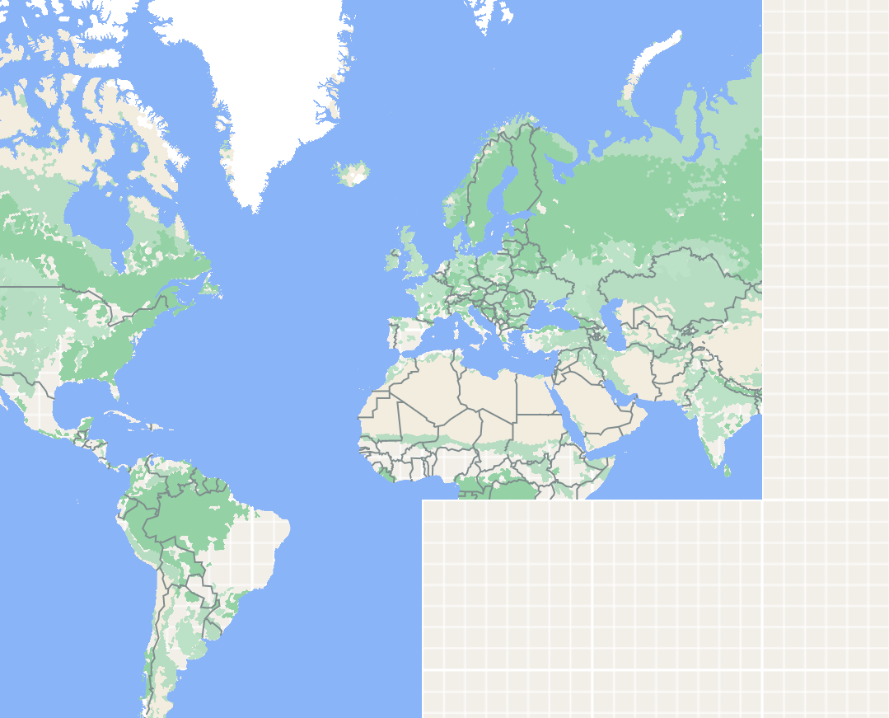

# background-grid
Background grid in MapLibre GL JS

Create a nice google/apple-maps-like background pattern in MapLibre GL JS.

To best see the effect, turn on throtteling in your browser to simulate a slow connection.

## Demo

